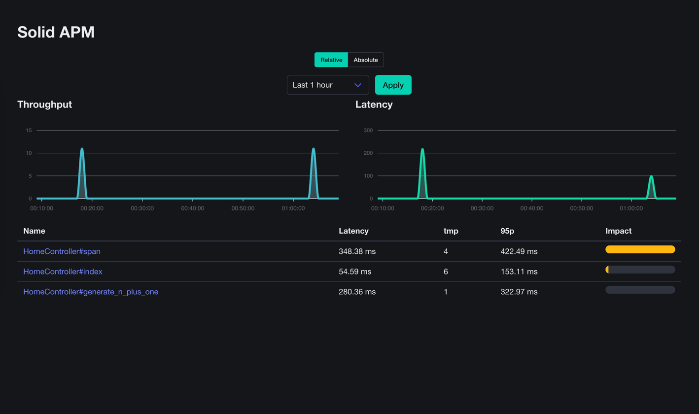
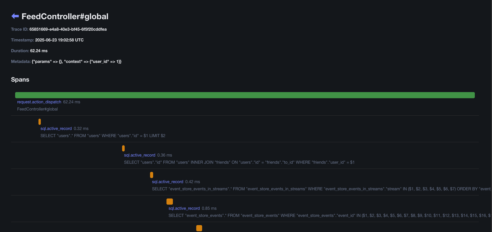

[](https://badge.fury.io/rb/solid_apm)

# SolidApm
Rails engine to manage APM data without using a third party service.




## Installation

Add to your Gemfile:

```shell
bin/bundle add solid_apm
```

Mount the engine in your routes file:
```ruby
# config/routes.rb
Rails.application.routes.draw do
  mount SolidApm::Engine => "/solid_apm"
end
```

Routing constraint can be use to authorize access. 
See [Routing constraint](https://guides.rubyonrails.org/routing.html#advanced-constraints)
for more information.

Configure the database connection:
```ruby
# config/initializers/solid_apm.rb
SolidApm.connects_to = { database: { writing: :solid_apm } }
```

Install and run the migrations:
```shell
DATABASE=solid_apm bin/rails solid_apm:install:migrations
```

## Usage

Go to `http://localhost:3000/solid_apm` and start monitoring your application.

Add context

```ruby
class ApplicationController
  before_action do
    SolidApm.set_context(user_id: current_user&.id)
  end
end
```

## TODOs

### Features

- [ ] Better handle subscribing to ActiveSupport notifications
- [ ] Custom events

### Interface

- [ ] Paginate transactions list
- [ ] Allow date range transactions index

## Contributing
Contribution directions go here.

## Release

```shell
gem bump -tp -v minor
```

## License
The gem is available as open source under the terms of the [MIT License](https://opensource.org/licenses/MIT).
