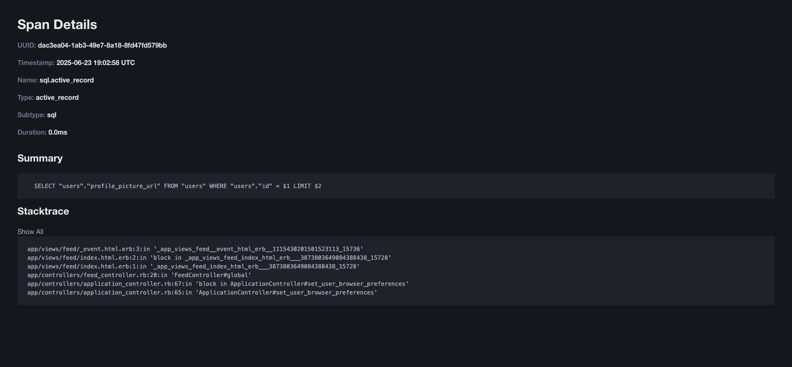

[](https://badge.fury.io/rb/solid_apm)

# SolidApm
Rails engine to manage APM data without using a third party service.




## Installation

Add to your Gemfile:

```shell
bin/bundle add solid_apm
```

Mount the engine in your routes file:
```ruby
# config/routes.rb
Rails.application.routes.draw do
  mount SolidApm::Engine => "/solid_apm"
end
```

Routing constraint can be use to authorize access. 
See [Routing constraint](https://guides.rubyonrails.org/routing.html#advanced-constraints)
for more information.

Configure the database connection:
```ruby
# config/initializers/solid_apm.rb
SolidApm.connects_to = { database: { writing: :solid_apm } }
```

Install and run the migrations:
```shell
DATABASE=solid_apm bin/rails solid_apm:install:migrations
```

## Usage

Go to `http://localhost:3000/solid_apm` and start monitoring your application.

Add context

```ruby
class ApplicationController
  before_action do
    SolidApm.set_context(user_id: current_user&.id)
  end
end
```

## Configuration

SolidAPM can be configured using the following options in your `config/initializers/solid_apm.rb` file:

### Database Connection

Configure the database connection for SolidAPM:

```ruby
SolidApm.connects_to = { database: { writing: :solid_apm } }
```

### ActiveRecord Logger Silencing

Control whether ActiveRecord logger is silenced during SolidAPM operations (default: `true`):

```ruby
# Disable ActiveRecord logger silencing to see SQL queries in logs
SolidApm.silence_active_record_logger = false
```

### Transaction Sampling

Control the sampling rate for transactions using a "1 out of N" approach (default: `1`):

```ruby
# Sample every transaction (default behavior)
SolidApm.transaction_sampling = 1

# Sample 1 out of every 2 transactions (50% sampling)
SolidApm.transaction_sampling = 2

# Sample 1 out of every 5 transactions (20% sampling)  
SolidApm.transaction_sampling = 5

# Sample 1 out of every 10 transactions (10% sampling)
SolidApm.transaction_sampling = 10
```

The sampling is done per-thread using a round-robin counter, ensuring even distribution across requests.
This is useful for high-traffic applications where you want to reduce the volume of
APM data while still maintaining representative performance insights.

### Transaction Name Filtering

Filter specific transactions by name using exact string matches or regular expressions:

```ruby
# Filter specific transactions by exact name
SolidApm.transaction_filters += ['HomeController#index', /^Rails::HealthController/]
```

## How it works

SolidAPM stores information in the form of transactions, representing incoming HTTP requests which
listen to a variety of spans (events) from `ActiveSupport::Instrument`. Each span
saves backtrace information to easily find the source of issues.

### Request transaction

It is based on [ActionDispatch](https://guides.rubyonrails.org/active_support_instrumentation.html#action-dispatch)
events to start and end a transaction.

A Rack middleware uses [`rack.after_reply`](https://github.blog/engineering/architecture-optimization/performance-at-github-deferring-stats-with-rack-after_reply/)
to bulk insert transactions and spans after delivering the response, so tracking your application
doesn't add delay to the client.

### Spans saved

* Request
* Rendering
* SQL requests and transactions 
* Rails cache
* Net/HTTP

## MCP Server

SolidAPM offers an optional MCP server to allow an AI agent to interact with SolidAPM
and help identify issues in your application, such as  
N+1 queries, slow queries and more. The AI agent can analyze and suggest fixes for these issues.

### MCP Server Configuration

The MCP server is only mounted if the [fast-mcp](https://github.com/yjacquin/fast-mcp) gem is installed by your application.

1. Add to your Gemfile:

```ruby
# Work in progress, plus patch for MCP 2025-06-18 Protocol Revision
# with StreamableHTTP support
# https://github.com/yjacquin/fast-mcp/issues/109
gem 'fast-mcp', branch: 'transport', github: 'Bhacaz/fast-mcp'
```

2. Configure the MCP server in your `config/initializers/solid_apm.rb`:

```ruby
SolidApm.mcp_server_config = {
  name: 'my-app-solid-apm',
  path: '/solid_apm/mcp',
  auth_token: Rails.application.credentials.solid_apm[:mcp_auth_token]
}
```

3. Test the MCP server by running:

```shell
curl -X POST http://localhost:3000/solid_apm/mcp \
  -H "Content-Type: application/json" \
  -H "Accept: application/json" \
  -H "Authorization: Bearer <AUTH_TOKEN>" \
  -d '{"jsonrpc":"2.0","method":"tools/list","id":1}
```

### MCP usage

1. Add the MCP resource `impactful-transactions` to the context of your prompt.
2. Prompt example: "Analyze the impactful transactions of my application and suggest improvements, base on the spans details."
3. Allow the AI agent to use the MCP tool `spans-for-transaction` to retrieve the longest spans for a specific transaction.

## TODOs

### Features

- [ ] Better handle subscribing to ActiveSupport notifications
- [ ] Custom events

### Interface

- [ ] Paginate transactions list
- [ ] Allow date range transactions index

## Contributing
Contribution directions go here.

## Release

```shell
bin/bump major|minor|patch
# GitHub Actions will take care of the rest
```

## License
The gem is available as open source under the terms of the [MIT License](https://opensource.org/licenses/MIT).
